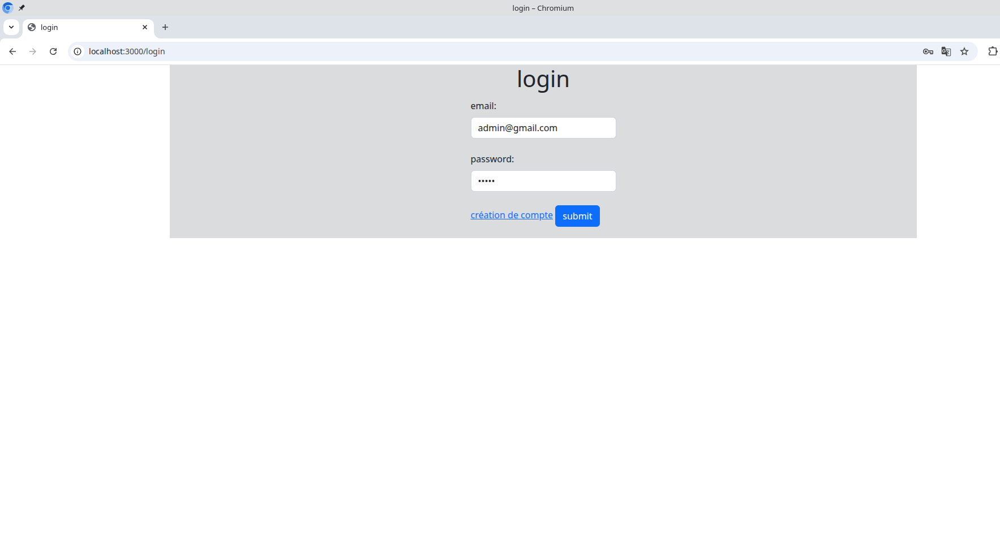

     
Yvon Point : yvon.point@etu.utc.fr
Alberic Preveraud De Vaumas : alberic.preveraud-de-vaumas@etu.utc.fr 

 

        

RAPPORT projet SR10 

   

création d'un site web 

    

"pôle emploi" : site d'annonces d'emploi

 
 
 

# introduction 

Le but de ce TP est d'apprendre à créer un site web fonctionnel selon un cahier des charges en utilisant essentiellement les frameworks Bootstrap (frontend), Node.js et express (backend). 

# I. présentation rapide

Nous avons choisi de faire une page principale par rôle avec des filtres pour éviter d'avoir trop de pages. Par exemple l'affichage des demandes d'administreur et de la liste de tous les utilisateurs est géré par une unique page administrateur.

Par défaut on arrive sur la page "login".

## 1.page utilisateur

- si on est simple utilisateur le bouton "Admin" (respectivement "Recruteur") permet de faire une demande pour devenir administrateur (ou recruteur). 

<figcaption align = "center"><b>demande droits recruteur</b> (après avoir crée une entreprise)</figcaption>

La demande est mémorisée dans la table Utilisateur de la Base de donnée.

- sinon on accède à la page administrateur ou recruteur selon notre rôle.

Par exemple après avoir cliqué sur le bouton "Admin" :

## 2.page administrateur

<figcaption align = "center"><b>page admin</b></figcaption>

le bouton "Utilisateur " permet de revenir sur la page utilisateur.
### 3.page recruteur

<figcaption align = "center"><b>page recruteur</b> </figcaption>

<figcaption align = "center"><b>page recruteur</b> création de fiche de poste</figcaption>

# II.sécurité

## 1.mot de passe

### recommandations.

Pour éviter les attaques par force brute (avec des listes de mot de passe) il est recommandé (imposé) d'utiliser un mot de passe de longueur minimale 12 caractères  et difficile à trouver (caractères spéciaux, etc...).
Il serait aussi utile de bloquer le compte pendant un temps limité après 3 tentatives infructueuses.

<figcaption align = "center"><b>création utilisateur :</b> mot de passe fort </figcaption>

<figcaption align = "center"><b>création utilisateur :</b> code de vérification de la validité du mot de passe.</figcaption>

### hachage.

Au niveau du serveur, le mot de passe est haché avant d'être stocké dans base de données.
Il serait nécessaire en plus d'avoir une connexion sécurisée (https) pour que le mot de passe ne soit pas envoyé en clair (http).

<figcaption align = "center"><b>base de donnée </b> utilisateur : mot de passe haché (ou pas).</figcaption>

### code :

<figcaption align = "center"><b>code </b> model/user.js : utilisation de **bcrypt** pour hacher le mot de passe</figcaption>
On utilise la librairie bcrypt lors de la création d'un utilisateur et lors du login. Tout est centralisé dans un seul fichier de type model_js (modèle MVC).
Bcrypt fonctionne aussi si les mots de passe ont été préalablement stockés en clair.

## 2.protection injection sql.

- principe de l'attaque : du code sql est écrit dans des champs d'un formulaire afin qu'il soit exécuté sur le serveur.
- remède : sql préparées ('?' remplacé par des paramètres) .

<figcaption align = "center"><b>code </b> model/user.js : utilisation de **requêtes préparées**</figcaption>

## 3. contrôle des accès.

- En entrant l'url dans la barre d'adresse du navigateur, un pirate pourrait accéder à des ressources ou fonctionnalités reservées à l'administrateur.

<figcaption align = "center"><b>tentative d'accès à la page administrateur </b> => ici renvoie à l'accueil (login)</figcaption>

- grace à la bibliothèque session on enregistre le rôle (donc les  privilèges) de l'utilisateur connecté et on interdit les accès non autorisés.

<figcaption align = "center"><b>code </b> model/user.js : utilisation de **bcrypt** pour hacher le mot de passe</figcaption>
  
## conclusion sécurité.

La sécurité joue un rôle majeur dans la création de site web de nos jours. Il y a 40 ans les premiers sites web n'étaient *quasiment* pas protégés car les attaques étaient peu nombreuses : elles se sont développées véritablement à partir des années 1990.
Les techniques d'attaques sont de plus en plus nombreuses et complexes, un développeur web doit connaître toutes les méthodes pour se protéger, et se former continuellement.

## dernières modifications (version présentée en TD)

les mdp sont hashé coté client puis le hash est hashé coté serveur (remarque : les comptes créés avec l'ancienne version ne fonctionnent plus car il faudrait entrer le mot de passe haché pour se loger à cause du double hashage).

 Ça fonctionne, mais pas la methode adéquat. Je n'avais pas le temps de tout modifier. La version avec hachage côté serveur seule est moins sécurisée ou alors il faut utiliser https.

NON FAIT :
        => accepter/refuser les demandes de créations d'organisation
        => possibilité de voir nos candidatures sur la page "mon compte"
        

AMELIORATION POSSIBLE :
        => code plus lisible avec plus de test/commentaire
        => fonction de debug pour rendre les tests plus facile
        => hashage du mdp a revoir (actuellement coté serveur et coté client => 2 opéartions non utiles)
        

# III. conclusion

Ce projet nous a permis de : 
- nous former sur la création de site web (HTML,CSS+Javascript) grace à : 
    - Bootstrap
    - Node.js + express

qui sont des frameworks très utilisés.

- D'apprendre à gérer les sessions et la sécurité.
- découvrir les API REST
- coté serveur : gérer la base de données.
- Choisir entre un modèle "M.V.C" ou bien "single-page application (SPA) avec *Vue.js* 

Pour l'organisation nous nous sommes répartis les taches en fonction de nos préférences tout en essayant de participer tous les deux à la fois à la partie backend et frontend.
Nous avons choisi d'utiliser GitHub (plus partique) et de coder chacun dans notre branche puis fusionner régulièrement dans la branche main lorsque le code fonctionnait bien.

Au final, le site que nous avons créé a été testé et fonctionne globalement bien, il reste toutefois des petites corrections ou modifications à apporter. Nous les avons identifiées mais nous manquons de temps pour les faire en cette période de révisions pour les examens. 
En conclusion, ce projet nous a permis de découvrir beaucoup de techniques web (frameworks bootstap, Node.js, express, etc...) et nous a sensibilisé aux problèmes de sécurités. Nous avons également une meilleure idée de la grande quantité de travail à produire pour créer un *petit* site web.